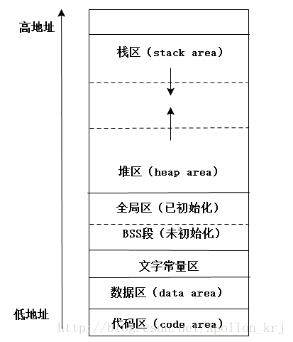
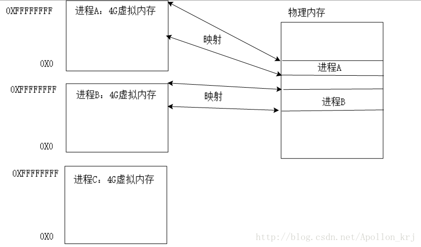

### 内存管理与分页机制

#### 问题提出

我们经常会使用malloc()以及free()函数进行堆区内存申请与释放。那么你是否会这样做：

```c
int * p = malloc(0);/*malloc分配了0个字节吗，如果是那么p指向谁呢，是NULL吗*/
free(p);/*假如malloc分配了0个字节，p指向了NULL，那么free(NULL)不会出现段错误吗*/
```

我们来写一段测试代码看看：

```c++
/*****************************
**
**测试环境：minGw gcc 5.1.0
**测试int * p = malloc(0);p是否指向NULL
**
*****************************/
#include<stdio.h>
#include<stdlib.h>
int main(void){
    int * p = (int *)malloc(0);
    printf("%d,%d\n",*(p),*(p+1024));	//44504552,1735355490
    free(p);

    //int * q = NULL;
    //printf("%d,%d\n",*(q),*(q+1024));	//Segmentation fault
    return 0;
}

//build: gcc 20180224-malloc-test.c -o 20180224-malloc-test
```

在测试中我们可以看到，q指针指向NULL，所以对其取值会发生段错误，而对于p来说，虽然它申请了0字节的空间，但是free()释放以及取值时都不会发生段错误（读者可以拆开测试，否则有人会怀疑是free()引发的的段错误，而不是`*q`取q值时引发的段错误）。由此我们可以得知，malloc(0)分配的不是0个字节，p也不是指向NULL。那malloc(0)分配了几个字节？并且为什么*(p+1024)也不会越界发生段错误呢？这就是内存的分页机制与内存管理所决定。

#### 虚拟内存（Virtual Memory）与物理内存（Physical memory）

#####  内存类型细分

内存由于用途不同，分类也不尽相同，一般我们对于内存的分类也就这几种：栈区（stack area）、堆区（heap area）、全局区（静态区）（存放全局变量与静态变量static）、BSS段（存放未初始化的全局变量，未初始化的全局变量默认值为0）、文字常量区、数据区（data area）、代码区（code area）等。而关于这些不同类型的内存地址区域，其所在位置如下图所示：



##### 内存地址映射关系

每个进程都先天设定了4G的虚拟内存地址（不是真实的地址，只是一个编号）。虚拟内存开始时不对应任何内存，直接使用会引发段错误，不进入内核就接触不到物理内存地址，只会接触到虚拟内存地址。虚拟内存地址必须映射物理内存（或者硬盘上的文件）以后才能存储数据（数据存储在物理内存上，打印地址为虚拟内存地址）。而内存分配其实就是虚拟内存地址映射物理内存的过程，内存回收则是解除映射关系的过程。 
虚拟内存中，0~3G是用户控制，3~4G是内核空间。用户层不能直接访问内核层，可以通过Unix/Linux的系统函数访问内核层。我们通常所讲内存地址，其实都不是真正意义上的物理内存（PC机上内存硬件）的地址，而是虚拟内存地址。两个不同的进程，当其某个变量地址一样（虚拟），但是物理地址并不一样。

映射关系如图所示（A、B进程均已映射物理内存，而C进程未映射物理内存，注意：虚拟内存一般并不会全部映射）：




#### 内存分页机制（Memory Paging Mechanism）与malloc详解

##### 内存管理页机制

最小存储单位是一个字节（1B），最小管理单位是一页（4KB），虚拟内存地址连续时物理内存地址可以不连续，即使一次分配6000字节（不到两页也分配两页），两个内存页物理地址可能不挨着。多次申请内存时，如果之前分配的页内存没用完，则不再分配，除非之前分配的内存页用完才继续映射新的一页。getpagesize()可以获取当前内存页的大小。硬盘也是如此（硬盘上称为Block块）：即使一个.txt文件中只有一个“a”字母，其大小为1B而其占用大小为4K。

##### malloc(0)分配了多少内存

为了方便内存管理，防止程序每申请一次内存就分配内存，操作系统会分配多余程序所申请的内存数，至少是一页（4k），不同的操作系统实现可能不一样。

例如：malloc(sizeof(int))申请了4字节，系统却给它33页，而malloc()给变量分配给变量内存时，除了数据区域外，还额外需要保存一些信息。底层有一个双向链表保存额外信息。malloc()给指针了12个字节，其中4个字节存放数据，另外8个存放其他信息或者空闲，如果将12个字节中前（低位）几个字节清空或者进行修改，free就可能出错，因为free只有首地址不能释放，还得需要额外附加信息（如malloc分配的长度）。（低八位是附加数据，高四位是int型数据）

有这样的内存分配场景：p申请了0字节,但是系统分配了0X08fa9000~0X08fca000（共0X08fca000-0X08fa9000=21000H=(2^17+2^12)Byte=(2^7+2^2)KB=(2^5+1)页=33页）。实际上p指向的地址为0X08fa9008（偏移了8个字节），直接指向高四位的4个字节（共12字节）：


如果我们将低八位的数据进行清空或者修改（修改任意个字节），free就有可能失败。

