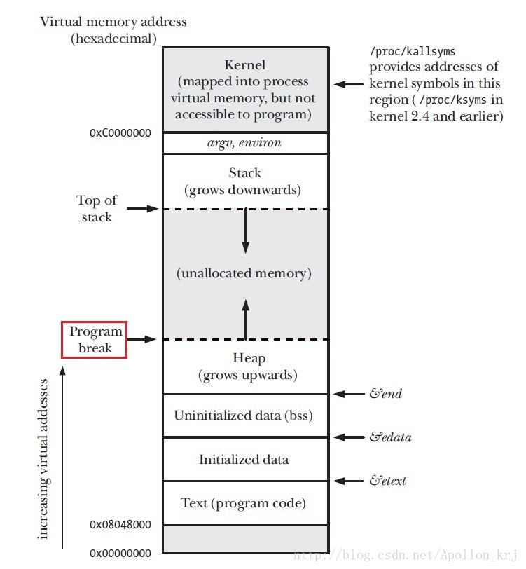
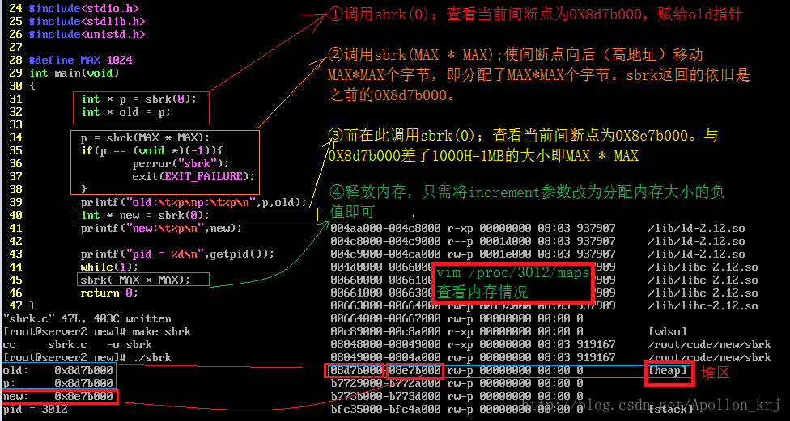

### 系统调用与内存管理

#### 1、系统调用

在Linux中，4G内存可分为两部分——内核空间1G（3~4G）与用户空间3G（0~3G）,我们通常写的C代码都是在对用户空间即0~3G的内存进行操作。而且，用户空间的代码不能直接访问内核空间，因此内核空间提供了一系列的函数，实现用户空间进入内核空间的接口，这一系列的函数称为系统调用（System Call）。比如我们经常使用的open、close、read、write等函数都是系统级别的函数（man 2 function_name），而像fopen、fclose、fread、fwrite等都是用户级别的函数（man 3 function_name）。不同级别的函数能够操作的内存区域自然也就不同。

> 用户层（malloc）——> 内核与用户层接口，系统调用（sbrk，brk，map，unmap）——>kernel leyer

对于C++中new与delete的底层则是用malloc和free实现。而我们所用的malloc()、free()与内核之间的接口（桥梁）就是sbrk()等系统函数；当然我们也可以直接调用系统调用（系统函数）,达到同样的作用。我们可以用下面这幅图来描述基本内存相关操作之间的关系：

> **内存管理**
>***用户层*** ：
>STL（内存自动分配与回收）
>|
>c++（new和delete）
>|
>C语言（malloc和free）
----
>|
>Unix系统函数（sbrk，brk，分配与回收内存）
>|
>Unix系统函数（mmap分配，unmap回收）
----
>|
> ***内核层***
> |
> kmalloc()，vmalloc()
> |
> get_free_page()

虽然使用系统调用会带来一定的好处，但是物极必反，系统调用并非能频繁使用。由于程序由用户进入内核层时，会将用户层的状态先封存起来，然后到内核层运行代码，运行结束以后，从内核层出来到用户层时，再把数据加载回来。因此，频繁的系统调用效率很低。

#### 2、系统调用： brk()与sbrk()

#####  函数原型

``` c
#include<unistd.h>
int brk(void * addr); 
void * sbrk(intptr_t increment);
```

##### 描述 

brk()和sbrk()改变程序间断点的位置。程序间断点就是程序数据段的结尾。（程序间断点是为初始化数据段的起始位置）.通过增加程序间断点进程可以更有效的申请内存 。当addr参数合理、系统有足够的内存并且不超过最大值时brk()函数将数据段结尾设置为addr,即间断点设置为addr。sbrk()将程序数据空间增加increment字节。当increment为0时则返回程序间断点的当前位置。

##### 返回值

brk()成功返回0，失败返回-1并且设置errno值为ENOMEM（注：在mmap中会提到）。 
sbrk()成功返回之前的程序间断点地址。如果间断点值增加，那么这个指针（指的是返回的之前的间断点地址）是指向分配的新的内存的首地址。如果出错失败，就返回一个指针并设置errno全局变量的值为ENOMEM。

##### 总结

这两个函数都用来改变 “program break” (程序间断点)的位置，改变数据段长度（Change data segment size），实现虚拟内存到物理内存的映射。 
brk()函数直接修改有效访问范围的末尾地址实现分配与回收。sbrk()参数函数中：当increment为正值时，间断点位置向后移动increment字节。同时返回移动之前的位置，相当于分配内存。当increment为负值时，位置向前移动increment字节，相当与于释放内存，其返回值没有实际意义。当increment为0时，不移动位置只返回当前位置。参数increment的符号决定了是分配还是回收内存。而关于program break的位置如图所示：

内存由于用途不同，分类也不尽相同，一般我们对于内存的分类也就这几种：栈区（stack area）、堆区（heap area）、全局区（静态区）（存放全局变量与静态变量static）、BSS段（存放未初始化的全局变量，未初始化的全局变量默认值为0）、文字常量区、数据区（data area）、代码区（code area）等。而关于这些不同类型的内存地址区域，其所在位置如下图所示：



##### #### 测试

对于分配好的内存，我们只要有其首地址old与长度MAX*MAX即可不越界的准确使用（如下图所示），其效果与malloc相同，只不过sbrk()与brk()是C标准函数的底层实现而已，其机制较为复杂（测试中，死循环是为了查看maps文件，不至于进程消亡文件随之消失）。 




虽然，sbrk()与brk()均可分配回收兼职，但是我们一般用sbrk()分配内存，而用brk()回收内存，上例中回收内存可以这样写：

```c
int err = brk(old);
/**或者brk(p);效果与sbrk(-MAX*MAX);是一样的，但brk()更方便与清晰明了。**/
if(-1 == err){
    perror("brk");
    exit(EXIT_FAILURE);
}
```

